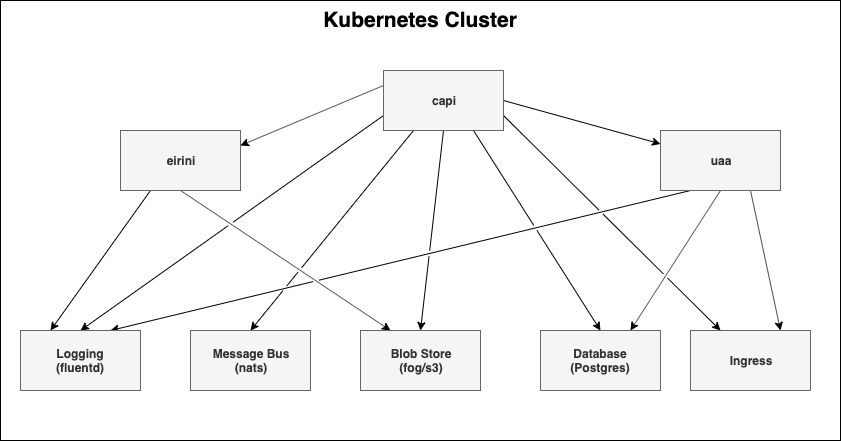

# Cloudfoundry on Kubernetes

## Deployment problem

A setup of cloudfoundry in kubernetes could look like the following diagram.

Setting up this scenario using plain helm might be challenging because it's quite 
hard to share instances like a database between helm charts.

## Possible solution

This problem could be solved quite easy using [shalm](https://github.com/kramerul/shalm.git)

Shalm uses helm rendering of templates and additionally allows you to define API between charts.

These API can be used to share instances

### Example

See 